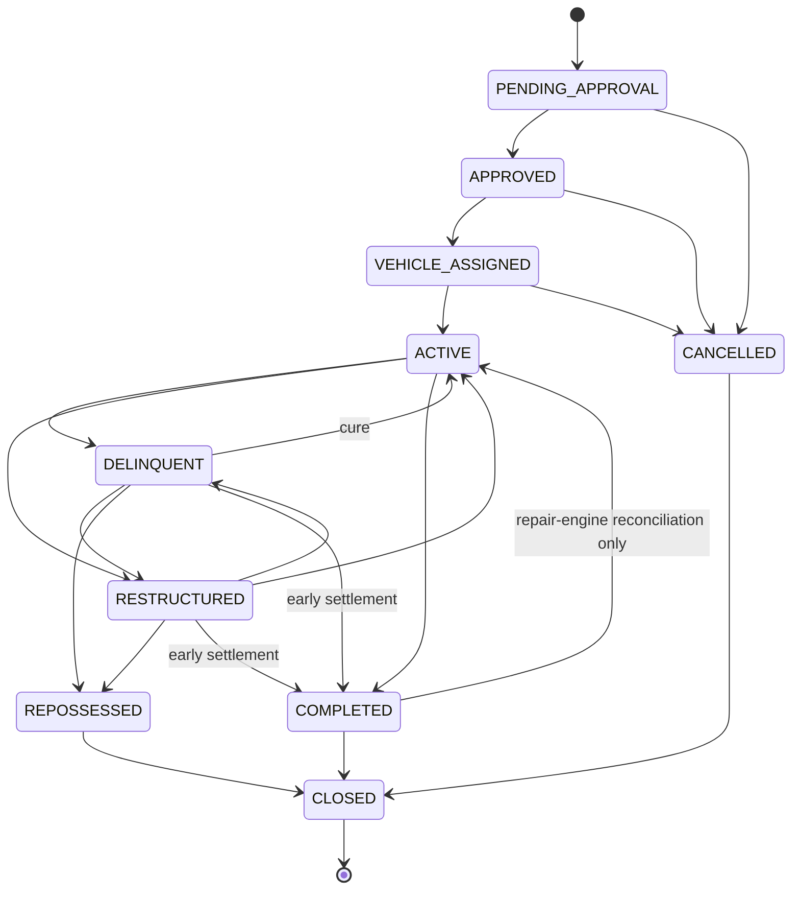

# Hire-purchase contract state machine

`models/HirePurchaseContract.ts` status changes are no longer a free-form
field. Every transition goes through
`lib/services/contract-transition.service.ts#transitionHirePurchaseContract`,
which validates the move against `lib/contracts/state-machine.ts`, checks who
is allowed to trigger it, enforces transition-specific preconditions, keeps
the linked `Vehicle` in sync, appends an immutable timeline entry, writes an
audit event, and enforces optimistic concurrency via a `version` field. Direct
`contract.status = ...` assignment or `findByIdAndUpdate({status: ...})` is no
longer supported anywhere in the codebase.

## States

| Status | Meaning |
| --- | --- |
| `PENDING_APPROVAL` | Contract drafted, awaiting admin review of terms. Initial state for new contracts. |
| `APPROVED` | Terms approved; no vehicle assigned yet. |
| `VEHICLE_ASSIGNED` | A specific, previously-`Available` vehicle has been allocated. |
| `ACTIVE` | Vehicle handed over, repayment schedule running. |
| `DELINQUENT` | Behind on payments; still recoverable (cure, restructure, or repossess). |
| `RESTRUCTURED` | Terms were renegotiated; contract is current again under the new terms. |
| `COMPLETED` | Payable balance fully settled (on schedule or via early settlement). |
| `REPOSSESSED` | Vehicle repossessed after unresolved delinquency. |
| `CANCELLED` | Withdrawn before activation (no vehicle handed over yet). |
| `CLOSED` | Administrative sign-off after `COMPLETED` / `REPOSSESSED` / `CANCELLED`. Terminal. |

`ACTIVE`, `DELINQUENT` and `RESTRUCTURED` are the only "repayable" states
(`isRepayableState`) — a driver may record a repayment in any of them, and
`getDriverContract` treats all three as the driver's current contract.

## State diagram

## Transition matrix, permissions and preconditions

| From → To | Allowed actors | Preconditions |
| --- | --- | --- |
| `PENDING_APPROVAL` → `APPROVED` | admin | reason only |
| `PENDING_APPROVAL` / `APPROVED` / `VEHICLE_ASSIGNED` → `CANCELLED` | admin, driver (own contract) | reason only |
| `APPROVED` → `VEHICLE_ASSIGNED` | admin | `vehicleId` provided; vehicle exists and `status === "Available"` |
| `VEHICLE_ASSIGNED` → `ACTIVE` (activation) | admin, system | driver `kycStatus === "approved_stage2"`; `vehicleId` present; terms valid (`totalPayableNgn`, `durationWeeks`, `weeklyPaymentNgn` > 0, valid `startDate`); a repayment schedule can be generated from those terms |
| `DELINQUENT` / `RESTRUCTURED` → `ACTIVE` (cure) | admin, system | reason only — activation checks do not re-run on cure |
| `COMPLETED` → `ACTIVE` (reconciliation) | admin, system | reason only — used exclusively by `lib/integrity/repairEngine.ts`'s `REOPEN_OR_RECONCILE_CONTRACT` strategy to fix a legacy `COMPLETED` contract that still has a payable balance |
| `ACTIVE` / `RESTRUCTURED` → `DELINQUENT` | admin, system | reason only |
| `ACTIVE` / `DELINQUENT` → `RESTRUCTURED` | admin | at least one of `totalPayableNgn`, `weeklyPaymentNgn`, `durationWeeks`, `startDate` supplied in `restructure` |
| `DELINQUENT` / `RESTRUCTURED` → `REPOSSESSED` | admin | reason only |
| `ACTIVE` / `DELINQUENT` / `RESTRUCTURED` → `COMPLETED` | admin, system | `totalPaidNgn >= totalPayableNgn` (covers both on-schedule completion and early settlement) |
| `COMPLETED` / `REPOSSESSED` / `CANCELLED` → `CLOSED` | admin, system | reason only |

Every call also requires a non-empty `reason` string. `actor.type` is always
one of `"driver" | "admin" | "system"`, so system-triggered transitions (e.g.
automatic completion on final payment, the repair-engine reconciliation path)
are always distinguishable in the timeline from admin/driver actions.

A contract may never leave `CLOSED`, and `REPOSSESSED`/`CANCELLED` never reach
`COMPLETED` — once a vehicle is repossessed or the deal never activated, there
is no "complete the purchase" path.

## Side effects

- **Vehicle sync**: assigning a vehicle sets it to `Reserved`; activation sets
  it to `Financed` and stamps `driverId`; repossession sets it back to
  `Reserved` and clears `driverId`. Contracts created before `vehicleId`
  existed have nothing to sync — that is recorded explicitly as
  `metadata.vehicleSyncSkipped: true` on the timeline entry rather than being
  silently dropped.
- **Timeline**: every transition appends an entry to `contract.timeline`
  (`fromState`, `toState`, `actorType`, `actorUserId?`, `reason`, `metadata?`,
  `timestamp`). This is the authoritative, in-document transition history;
  nothing in the API surface can rewrite or remove entries.
- **Audit log**: every transition also calls `logAuditEvent` with action
  `CONTRACT_TRANSITION_<TARGET_STATE>`. `"contract"` is in the audit module's
  critical-action keyword list, so these events always go through the
  tamper-evident, hash-chained audit log in addition to the plain `AuditLog`
  collection.
- **Atomicity**: the whole transition (contract update, vehicle sync, audit
  write) runs inside a Mongoose session/transaction, matching the existing
  `lib/settlement/settlement-service.ts` convention (no outbox/message-queue
  infrastructure exists in this codebase). When called with an existing
  `session` (as `driver-contracts.service.ts` and `repairEngine.ts` do), the
  transition is folded into the caller's own transaction, so an unrelated
  failure later in that transaction rolls the contract change back too.

## Optimistic concurrency

Every contract has a `version` counter, incremented on every transition. The
update is `findOneAndUpdate({_id, version: expectedVersion}, {$inc: {version: 1}, ...})`
— if another transition wins the race and bumps the version first, this
returns no match and `transitionHirePurchaseContract` throws
`ContractConcurrencyError`. Two competing transitions on the same contract can
therefore never both apply; the loser must reload the contract and retry with
the new version. Documents written before this field existed have no
`version` key at all in MongoDB (not even `0`) — the service treats "missing"
and "0" as equivalent so legacy contracts stay transitionable immediately,
without waiting on the migration below.

## Legacy data migration

`scripts/migrate-hire-purchase-contracts.ts` (`migrateLegacyHirePurchaseContracts`)
backfills existing contracts written before this state machine existed:

- remaps the retired `"DEFAULTED"` status to `"DELINQUENT"` (the closest
  semantic match — no repossession workflow existed previously, so
  "defaulted" only ever meant "behind on payments")
- sets `version: 0` where missing
- seeds a single `timeline` entry (`fromState: null`, `toState: <current status>`,
  `actorType: "system"`, dated to the contract's original `createdAt`) where
  the timeline is empty, so every contract has at least one history record

Run with `npx tsx scripts/migrate-hire-purchase-contracts.ts`.

## Recovery rules

- A transition rejected for an invalid state or a missing precondition throws
  `ContractTransitionError` with a `code` of `INVALID_TRANSITION`,
  `FORBIDDEN_ACTOR`, `PRECONDITION_FAILED`, `REASON_REQUIRED`, `NOT_FOUND`, or
  `INVALID_INPUT` — none of these leave any write behind.
- A version conflict throws `ContractConcurrencyError`
  (`code: "CONCURRENCY_CONFLICT"`); the caller should reload the contract and
  retry the transition with the fresh state, not blindly resubmit the same
  `expectedVersion`.
- A `COMPLETED` contract with a remaining payable balance (a legacy
  data-integrity bug this state machine otherwise prevents by construction)
  is reopened to `ACTIVE` only through `lib/integrity/repairEngine.ts`'s
  `REOPEN_OR_RECONCILE_CONTRACT` strategy, which now calls
  `transitionHirePurchaseContract` (falling back to a direct
  `findByIdAndUpdate` only when no replica set/session is available, matching
  that engine's pre-existing single-node fallback).
